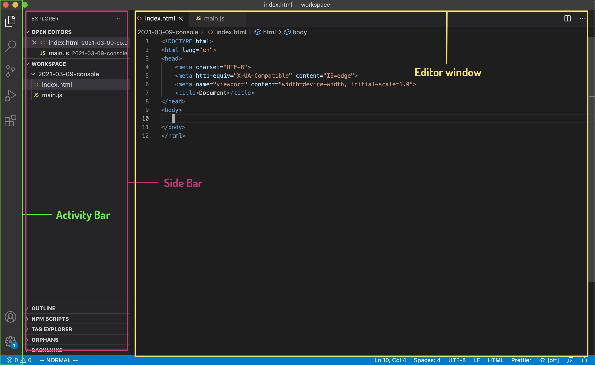

<!-- .slide: id="lesson3" -->

# Basic Frontend - Fall 2021

Lesson 3, Tuesday, 2021-09-21

---

### Lesson overview

1. using VSCode
1. loading `JavaScript` code inside an `HTML` page
1. basic debugging with `console.log()`
1. adding comments to our code

---

### From the console to VSCode

So far we've seen how to run small bits of JavaScript in the developer tools or directly into the `console`.

When to use the console:

- perform simple and small calculations
- quickly test single lines of code
- check error messages
- basic debugging (we'll see it today)

---

### From the console to VSCode

The `console` is not meant for coding.

The same way as we write `HTML` in a separate `.html` file, we write our JavaScript programs/scripts in a `.js` file.

---

### From the console to VSCode
#### VSCode interface

 <!-- .element style="width: 800px;" -->

---

### Our first JavaScript program

1. open VSCode
1. from the `File` menu item choose `Open...`
1. select a folder where you want to keep your programs and exercises and click on the `Open` button
1. if not open yet, click on `View -> Explorer` to open the file explorer sidebar on the left
1. create a new file `File -> New file`
1. save it as `main.js`
1. inside the file write `console.log("Hello world!");`

We'll see soon what `console.log()` is.
<!-- .element: class="fragment" -->


---

### Our first JavaScript program

What do we do now?

In order to run our program inside the browser, we have to somehow connect it to an `HTML` page
<!-- .element: class="fragment" -->

Let's create one!
<!-- .element: class="fragment" -->

---

### Our first JavaScript program

1. inside the same folder in VSCode create a new file
1. save it as `index.html`
1. inside, create an empty HTML page (next slide) 

---

### Our first JavaScript program

```html
<!DOCTYPE html>
<html>
  <body>
  </body>
</html>
```

We have an empty `HTML` page now. One more step to link our script to the page.

---

### Our first JavaScript program

Let's add this single line at the end of the `<body>` element

```html
<!DOCTYPE html>
<html>
  <body>

    <script src="main.js"><script>
  </body>
</html>
```

Load the page in the browser and check the console.

---

### The script tag

```html
<script src="main.js"></script>
```

- very similar to the `` tag
- we use the `src` attribute to specify the JavaScript file we want to load on the page
- we can put it anywhere in the HTML document, but it's good practice to put it at the end of the `<body>`

---

### From VSCode the console

Let's try to run a simple program.

Write the code below in the `main.js` file and reload the page

```js
let ticketPrice = 8;
let friends = 4;
let popcornPrice = 10;
let totalBudget = 30;
let totalPrice = friends * (ticketPrice + popcornPrice);
let canGoToCinema = totalBudget >= totalPrice;
```

Did it work?
<!-- .element: class="fragment" -->

---

### From VSCode to the console

So far we've been working directly inside the JavaScript console in the browser.

It meant that to run our code and see a result or a response from JavaScript we didn't need to do anything special.
<!-- .element: class="fragment" -->

Now that our code is inside a script we have to be explicit about showing output in the console.
<!-- .element: class="fragment" -->

---

### A note on variables

We use the `let` keyword only when we want to create (declare) a new variable. We use it only once for each variable.

When we want to change the value contained in a variable we can't use the `let` keyword again. We need to write the variable name followed by the assignment operator to change its value.

```js
let budget = 10;
let applePrice = 1;
budget = budget - applePrice;
```

---

### Using console.log()

We use `console.log()` to tell our program to output something to the console.

Let's try it:

```js
let ticketPrice = 8;
let friends = 4;
let popcornPrice = 10;
let totalBudget = 30;
let totalPrice = friends * (ticketPrice + popcornPrice);
let canGoToCinema = totalBudget >= totalPrice;

console.log(canGoToCinema);
```

---

### Using console.log()

We can do better than that.

We've seen that the `+` operator can be used on strings and number/string combination to concatenate them into a new string.

Let's try to make our output a bit nicer:

```js
let ticketPrice = 8;
let friends = 4;
let totalPrice = friends * ticketPrice;

console.log("I'm planning to go to the cinema with " + friends + " friends.");
console.log("A ticket costs " + ticketPrice + "€");
console.log("In total, we would spend " + totalPrice + "€");
```

---

### Exercise

- create a few variables with information about you (even fake ones)
    - for example: name, age, favourite food, hobbies
- use console.log() to write a short introduction

Example output:

```plaintext
Hello, my name is Carlo.
I like non-Hawaii pizza.
I live in Berlin.
I like books, comics and playing the guitar.
```

---

### Solution 

```js
let name = "Carlo";
let favouriteFood = "non-Hawaii Pizza";
let placeLive = "Berlin";
let hobbiesText = "books, comics and playing guitar";

console.log("Hello, my name is " + name + ".");
console.log("I come from " + favouriteFood + "."); 
console.log("I live in " + placeLive + ".");
console.log("I like " + hobbiesText + ".");
```

---

### Debugging with console.log()

Debugging: the process of finding and (possibly) fixing bugs (errors) in our program.

We can use `console.log()` to keep track of a variable to see how it changes while our program runs.

---

### Debugging with console.log()

Let's see an example:

```js
let people = 9;
let ticketPrice = 8;
let popcornPrice = 10;
let drinksPrice = 5;
let promotionDiscount = 2;

let costs = ticketPrice + popcornPrice;
let total = costs - promotionDiscount * people;

people = people + 1;

total = total + ticketPrice;
total = drinksPrice * 3 + popcornPrice * 2;

console.log("Total is " + total);
```

`total` at the end is 35, a bit cheap for 10 people. Let's try to find what's wrong.

---

### Debugging with console.log()

I add console.log() here and there to check that values are correct at every step of the program.

```js
let people = 9;
let ticketPrice = 8;
let popcornPrice = 10;
let drinksPrice = 5;
let promotionDiscount = 2;

let costs = ticketPrice + popcornPrice;
let total = costs - promotionDiscount * people;

people = people + 1;

total = total + ticketPrice;
console.log("drinksPrice: " + drinksPrice);
console.log("popcornPrice: " + popcornsPrice);
total = drinksPrice * 3 + popcornPrice * 2;

console.log("Total is " + total);
```

---

### Debugging with console.log()

After some debugging, here's the correct version

```js
let people = 9;
let ticketPrice = 8;
let popcornPrice = 10;
let drinksPrice = 5;
let promotionDiscount = 2;

let costs = ticketPrice + popcornPrice;
let total = (costs - promotionDiscount) * people;

people = people + 1;

total = total + ticketPrice;
total = total + drinksPrice * 3 + popcornPrice * 2;

console.log("Total is " + total);
```

---

### Printing multiple values with console.log() 

We can use `console.log()` to print multiple values at once, by separating them with a comma.

```js
let people = 9;
let ticketPrice = 8;
let popcornPrice = 10;
let drinksPrice = 5;
let promotionDiscount = 2;

let costs = ticketPrice + popcornPrice;
console.log("people", people);
console.log("a single ticket costs:", ticketPrice);
console.log("costs", costs, "drinks price", drinksPrice);
```

---

### Commenting our code

In JavaScript (and in programming in general) comments are short texts to add extra information to our code.  

Comments are meant only for who writes or reads the code, and are ignored by JavaScript.

```js
// Average: divide the sum of a set of numbers by the number of values
// for example, if we have 4 numbers, we have to divide the sum by 4
let average = (2 + 6 + 3 + 9) / 4;
```

---

### Commenting our code

Two type of comments:

```js
// this is a one line comment
// another one line comment
// anything after // is ignored by JavaScript

/*
    This is
    a multi-line
    comment
*/

let a = 5; // I can put comments mostly everywhere
```

- Use comments only to add important information that is not already clear from reading the code.
- Good comments explain the **why** and not the **what**

---

### Try it for yourself

1. Open again the cinema exercise
1. comment a few lines of your choice
1. run the code again and see the difference

---

<!-- .slide: style="font-size:80%" -->

### Exercise: Shopping
1. create 3 variables to store the price for apples, bananas and kiwis.
1. create other 3 variables to store how many of each fruit you're going to buy
1. create a variable `totalPrice` to store the total of your shopping.
    - be sure to consider the quantity of each item to get the `totalPrice`
1. write a series `console.log()` statements to print an output similar to the one shown in the next slide, trying to get every numerical value from the variables you created

---

### Example output for Shopping exercise

```plaintext
SHOPPING
--------------
Apple x2: 3€
Banana x3: 3€
Kiwi x2: 2€
--------------
Total: 8€
--------------
```
