<!-- .slide: id="lesson5" -->

# Basic Frontend - Fall 2021

Lesson 5, Tuesday, 2021-09-28

---

### Recap

```js
let x = 1 + 2 * 3;
```

What is the value of `x`?

7 (multiplication has higher precedence than addition)
<!-- .element: class="fragment" -->

---

### Recap

```js
let x = 1 + 2 + 3;
```

What is computed first, `1 + 2` or `2 + 3`?

1 + 2 (Addition operator has left-to-right associativity)
<!-- .element: class="fragment" -->

---

### Recap

```js
x = y = z;
```

What is computed first, `x = y` or `y = z`?

y = z (Assignment operator has right-to-left associativity)
<!-- .element: class="fragment" -->

---

### Compound assignment operators

| Compound operator | Same as |
| ----------------- | ------  |
| `x += 42` | `x = x + 42` |
| `x -= 42` | `x = x - 42` |
| `x /= 42` | `x = x / 42` |
| `x *= 42` | `x = x * 42` |
| `x **= 42` | `x = x ** 42` |

Compound assignment operators are shorter ways of applying an operator on the variable and assigning the result back to the variable.

---

### Increment operator

To add `1` to a variable, we can use the increment operator `++`, e.g. `x++`:

```js
let x = 42;
x = x + 1; // x is now 43
x += 1;    // x is now 44
x++;       // x is now 45
```

---

### Decrement operator

To subtract `1` from a variable, we can use the decrement operator:

```js
let x = 42;
x = x - 1; // x is now 41
x -= 1;    // x is now 40
x--;       // x is now 39
```

---

There are also prefix operators `++x` and `--x` which we don't use in this course.
You can find the subtle difference on [MDN](https://developer.mozilla.org/en-US/docs/Web/JavaScript/Reference/Operators/Increment)

---

### Recap - if statements

What is an `if` statement? When do we use it?

If we want to conditionally execute some code, e.g. only if a certain condition is true.
<!-- .element: class="fragment" -->

---

### Recap

```js
if (condition) {
    console.log("yay, condition is true");
}
```

---

### Recap - block scope

Remember, variables defined in code blocks (`{}`) are only accessible within those blocks:

```js
if (condition) {
    let hour = 18;
}

console.log("hour is", hour); // ERROR!
```

---

### Abdullah's game

Abdullah invented a game where the player with the highest score wins. The score is the player's height (in cm) plus five times the player's age.

1. Create variables for the heights and ages for you and a person next to you
1. Calculate the scores for you and your neighbor
1. Decide who wins, output the winner and their score to the console. Remember: there can be a draw (both players with the same score).

---

```js
let myHeight = 160;
let myAge = 44;
let neighborHeight = 170;
let neighborAge = 26;
let myScore = myHeight + 5 * myHeight;
let neighborScore = neighborHeight + 5 * neighborHeight;
if (myScore > neighborScore) {
    console.log("I win with", myScore, "points");
}
if (neighborScore > myScore) {
    console.log("Neighbor wins with", neighborScore, "points");s
}
if (myScore === neighborScore) {
    console.log("It's a draw!");
}
```

---

### If-Else

Very often, we would like to conditionally execute something, and otherwise execute something else:

```js
if (budget >= 60) {
    console.log("Let's go to cinema!");
}
if (budget < 60) {
    console.log("Let's go to the park!");
}
```

---

### If...Else

```js
if (condition) {
  // some code
  // will execute if condition is true
} else {
  // other code
  // will execute if condition is false
}
```

---

### If-Else

```js
if (budget >= 60) {
    console.log("Let's go to cinema!");
} else {
    console.log("Let's go to the park!");
}
```

---

### Quiz

Can you change the following code to `if..else`?

```js
if (temperature > 25) {
  console.log("Go swimming");
}
if (temperature <= 25) {
  console.log("Go biking");
}
```

---

### Solution

```js
if (temperature > 25) {
  console.log("Go swimming");
} else {
  console.log("Go biking");
}
```

---

### If...Else-If...Else example

```js
if (day === 'Saturday') {
  console.log('Do all the shopping.');
} else if (day === 'Sunday') {
  console.log('Relax!');
} else {
  console.log('Wake up and go to work!');
}
```

Only one code block is executed in the `if..else if..else`. To determine which block, JavaScript will evaluate the conditions from top to bottom. The first condition that evaluates to true determines the block to be executed. All the other code blocks are ignored.

---

You can use [code-to-graph](https://crubier.github.io/code-to-graph/?code=aWYgKGRheSA9PT0gJ1NhdHVyZGF5JykgewogIGNvbnNvbGUubG9nKCdEbyBhbGwgdGhlIHNob3BwaW5nLicpOwp9IGVsc2UgaWYgKGRheSA9PT0gJ1N1bmRheScpIHsKICBjb25zb2xlLmxvZygnUmVsYXghJyk7Cn0gZWxzZSB7CiAgY29uc29sZS5sb2coJ1dha2UgdXAgYW5kIGdvIHRvIHdvcmshJyk7Cn0) for visualization:

<!-- .element height="500px" width="100%" style="background-color: #999999" -->

---

### Task

* Describe the weather based on the temperature:
  * Above 30
  * Above 20
  * Above 5
  * Everything else

---

<!-- Only if there's time after the exercise -->

### Is this correct?

```js
let temperature = 7;

if (temperature > 20) {
  console.log("it's warm");
} else if (temperature > 30) {
  console.log("too hot!!!");
} else if (temperature > 5) {
  console.log("perfect.");
} else {
  console.log("it's a bit chilly.")
}
```

Look at it in [code-to-graph](https://crubier.github.io/code-to-graph/?code=bGV0IHRlbXBlcmF0dXJlID0gNzsKCmlmICh0ZW1wZXJhdHVyZSA-IDIwKSB7CiAgY29uc29sZS5sb2coIml0J3Mgd2FybSIpOwp9IGVsc2UgaWYgKHRlbXBlcmF0dXJlID4gMzApIHsKICBjb25zb2xlLmxvZygidG9vIGhvdCEhISIpOwp9IGVsc2UgaWYgKHRlbXBlcmF0dXJlID4gNSkgewogIGNvbnNvbGUubG9nKCJwZXJmZWN0LiIpOwp9IGVsc2UgewogIGNvbnNvbGUubG9nKCJpdCdzIGEgYml0IGNoaWxseS4iKQp9Cg), can you find the bug?

Try with a temperature of 35, what does it print? <!-- .element: class="fragment" -->

---

### Correct solution

```js
let temperature = 35;

if (temperature > 30) {
  console.log("too hot!!!");
} else if (temperature > 20) {
  console.log("it's warm");
} else if (temperature > 5) {
  console.log("perfect.");
} else {
  console.log("it's a bit chilly.")
}
```

---

### Task

Let's go shopping. Create a variable containing the budget (try with `5`, `7`, `8` and `10`).

If we have enough money left, buy milk (2 EUR).
If we have enough money left, buy cheese (4 EUR).
If we have enough money left, buy bread (2 EUR).
If we have enough money left and we bought bread, buy butter (1 EUR).

Output to console what we bought and how much money is left.

---

### Task

You're a developer in a bookstore. Can you finish all the tasks in this JavaScript file?

[main.js](2021-09-28-bookstore/main.js)
