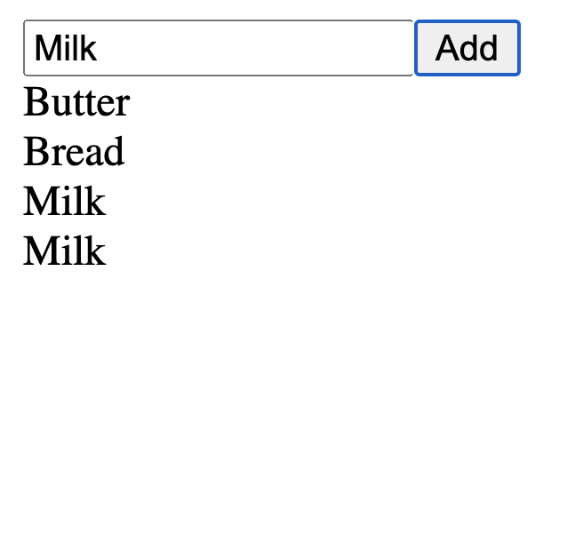

<!-- .slide: id="lesson13" -->

# Basic Frontend - Fall 2021

Lesson 13, Thursday, 2021-11-04

---

### Recap

---

### getElementById

HTML:
```html
<input id="myInput">
```

JS:
```js
let myInputElement = document.getElementById("myInput");
```

What JavaScript code do I need to write to change the input element to:

```html
<input id="myInput" type="number">
```

---

HTML:
```html
<input id="myInput" type="number">
```

JS:
```js
let myInputElement = document.getElementById("myInput");
myInputElement.type = "number";
```

---

HTML:
```html
<input id="myInput" type="number" min=0 max=99 placeholder="Amount">
```

JS:
```js
let myInputElement = document.getElementById("myInput");
myInputElement.type = "number";
myInputElement.min = 0;
myInputElement.max = 99;
myInputElement.placeholder = "Amount";
```

---

HTML

```html
<button id="myButton" onclick="myFunction()">Click me!</button>
```

How can we set the `onclick` property from JavaScript?

```js
let myButtonElement = document.getElementById("myButton");
// ???
```

---

### Variables pointing to functions

So far, we learned that variables can point to values:

```js
let age = 42;
let name = "Otto";
let isHappy = true;
let address = { street: "Ottostr.", city: "Berlin" }
```

---

### Functions can be values, too

Variables can also point to functions:

```js
let myFunction = function() { console.log("this function was called"); };
// myFunction is a variable pointing to our function
myFunction(); // calls the function above
```

The function above is also called an "anonymous" function, because the function
itself has no name.

---

HTML

```html
<button id="myButton" onclick="myFunction()">Click me!</button>
```

How can we set the `onclick` property from JavaScript?

```js
let myButtonElement = document.getElementById("myButton");
myButtonElement.onclick = function() { console.log("My button was clicked"); }
```

---

So far, we can get elements from HTML and manipulate them.

* We can set and get properties
* properties can be numbers, strings, booleans, object, functions...
* But what if we want to create a new element that's not in HTML yet?

---

### document.createElement

```js
// <div>hello</div> in JavaScript:
let myDiv = document.createElement("div"); // 1
myDiv.textContent = "hello";               // 2
document.body.appendChild(myDiv);          // 3
```

1. Create a new HTML element using `document.createElement`. Pass the type of the element (`div`, `button`, `img`, ...) as string.
2. Set all the properties you like, e.g. `textContent`, `onclick`, ...
3. appendChild add an element to the end of the list of children of a specific parent element. Here, we append it to the document's `<body>`.

---

### Task: Appending elements

Let's say you have this HTML:

```html
<div id="myDiv"></div>
```

How do you turn it to this from JavaScript?

```html
<div id="myDiv"><span>Hello</span></div>
```

* Hint: Use `document.getElementById`, `document.createElement`, the `textContent` property and `appendChild`.

---

### Create a shopping list app!

It should have one `<input>` field where the user can enter a shopping item. It should have one `<button>`. When the user clicks the button, the text from the `<input>` field should be appended to the shopping list.

 <!-- .element width="250px" style="display: block; margin: 0 auto;" -->

---

### Bonus (difficult!!!)

When the user clicks on a shopping item, remove it from the page.

* Hint: set an `onclick` function on your newly created HTML element.
* Hint: use the `remove()` method of your item to remove it.
