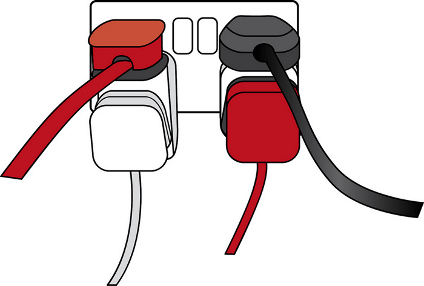

<!-- .slide: id="lesson17" -->

# Basic Frontend - Fall 2021

Lesson 17, Tuesday, 2021-11-23

---

### Recap: Arrays

```js
let arr = [1, 2, 3, 4, 5];
console.log(arr.length, arr[3]); // what does this output?
```

`5 4`
<!-- .element: class="fragment" -->

---

### Null

* There's one datatype that we haven't learned yet: `null`
* `null` is like `undefined`. It indicates the absence of a value.
* `null` can be used to indicate an *intentional* absence of an object value.
* Example: `document.getElementById("NoExist");` returns `null`

---

### Recap - DOM

* DOM is an API
* It allows us to add/remove/change any element of a web page
* We can make TODO lists and cool web shops
* But how would we create a web page with "dynamic" data, for example today's weather?

---

<!-- .slide: id="WebAPI" -->

# Web APIs

---

### Basic building blocks

We need to first learn about a few concepts:

1. JSON - How to exchange data
1. REST API - How to talk with a server
1. `fetch` API - How to connect to a server

---

### Object notation

In JavaScript, we can put all keys of objects in quotes. This is purely optional:

```js
let me = {
    "name": "John",
    lastName: "Doe",
    "hobbies": [ "Eat", "Sleep" ]
};

console.log(me.name); // "John"
```

---

### JSON

* JSON stands for **J**ava**S**cript **O**bject **N**otation
* It is a string representation of a JavaScript object
* All *keys* in our key value pairs must be in quotes
* Must contain only these types:
   * `string`, `number`, `boolean`, `array`
   * `null`
   * another JSON `object`
* These types are **forbidden**:
   * `function`, `undefined`

---

### Why JSON?

* When we exchange data between a browser and a server, we can only exchange string (not objects, arrays, numbers, booleans...)
* JSON is a string representation of JavaScript objects
* JSON can be easily transferred (and stored)
* The notation is very close to JavaScript objects, easy to handle from JavaScript. No complex transformation required.
* More info: https://developer.mozilla.org/en-US/docs/Learn/JavaScript/Objects/JSON

---

### JSON example

```json
{
    "name": "Bob",
    "instructor": true,
    "hobbies": [ "bike", "jog" ],
    "age": 42,
    "workAddress": {
        "street": "Invalidenstraße",
        "number": 116,
        "city": "Berlin"
    }
}
```

---

### Web API

* API stands for **A**pplication **P**rogramming **I**nterface
* A Web API is the *contract* between your application and a server

 <!-- .element height="400px" width="400px" -->

---

### REST API

* REST stands for **Re**presentational **S**tate **T**ransfer
* REST APIs work via http(s), the same protocol we use to connect to any website
* REST APIs commonly use JSON to exchange data
* Example for a REST API URL: https://restcountries.com/v3.1/lang/deu
* More info: https://developer.mozilla.org/en-US/docs/Glossary/REST

---

### What is missing?

* Now we know the data format to **exchange** data with a server: JSON
* Now we know the **interface** to a server: REST API
* But how do we **connect** to the server from within JavaScript?

---

### The dark past: XMLHttpRequest

```js
let url = 'https://something.com/';

function load(url, callback) {
 let xhr = new XMLHttpRequest();

 xhr.onreadystatechange = function() {
   if (xhr.readyState === 4) {
     callback(xhr.response);
   }
 }

 xhr.open('GET', url, true);
 xhr.send(null);
}
```

---

### fetch - Promises

```js
fetch("http://something.com").then(function(response) { return response.json(); }).then(function(json) { console.log("got json: " + json); });
```

---

### fetch - async/await

```js
async function fetchMyApi() {
  let response = await fetch("http://something.com");
  let result = await response.json();
  console.log(result);
}
```

---

### async/await

* Fetching data from the internet might take a lot of time
* We must not block our browser while waiting for the reply!
* `XMLHttpRequest` was working with callbacks. The API is ugly, error-prone and difficult to use
* `fetch` is a replacement. It returns a `Promise` object and doesn't require callbacks.
* `fetch` with `await/async` "hides" the complexity of `Promise`.

---

### async/await

* JavaScript introduced two new keywords: `async` and `await`
* We can use the `await` keyword only in `async` functions!
* `await` executes the call, continues executing the code which comes after the `async` function
* once the result of the `await` is available, the code in the `async` function resumes
* This allows us to execute long-running functions without blocking the browser

---

### Full fetch example

```js
async function fetchMyApi() {
  // connects to something.com
  let response = await fetch("http://something.com");
  // downloads the resource, converts JSON to an object
  let result = await response.json();
  console.log(result);
}

fetchMyApi();
```

---

### Let's play

* Open the following URL in your browser:
* https://restcountries.com/v3.1/lang/deu
* Describe the output

---

### Now, from JavaScript

```js
async function fetchCountries() {
  let response = await fetch("https://restcountries.com/v3.1/lang/deu");
  let result = await response.json();
  console.log(result);
}
fetchCountries();
```

* BONUS: Can you also print just the names of all the countries to console?

---

### Solution

```js
async function fetchCountries() {
  let response = await fetch("https://restcountries.com/v3.1/lang/deu");
  let result = await response.json();
  for (let i = 0; i < result.length; i++) {
    console.log(result[i].name);
  }
}
fetchCountries();
```

---

### Task

* Use the free API from https://restcountries.com
* Example API call:
   * https://restcountries.com/v3.1/name/germany
* Look at the result
* Use the `fetch` API to fetch the JSON.
* Can you show the name, capital, population and the flag on your web page?
* BONUS: Add an `<input>` field where the user can enter a country name, and a "search" button. When the user clicks "search", `fetch` and show the details about the country in the input field.
